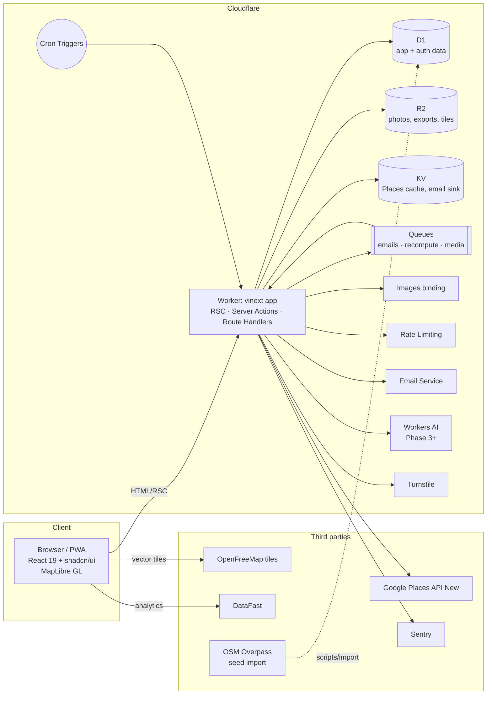

# 2. Architecture

## 2.1 System overview



A **single Worker** serves the whole app: pages (React Server Components), mutations (Server
Actions), JSON endpoints (Route Handlers under `/api/*`), better-auth (`/api/auth/*`), plus the
`queue` and `scheduled` handlers. There are no separate services until load requires them.

## 2.2 Stack decisions

| Concern | Choice | Why / notes |
|---|---|---|
| Framework | **vinext** (`vinext` + `@vinext/cloudflare`), App Router | Cloudflare's recommended Next.js-on-Workers path. Use `cloudflare:workers` `env` inside server components/actions. Run `npx vinext check` in CI to catch unsupported APIs. Avoid Next features vinext lacks (PPR, `next/image` loaders other than Cloudflare). |
| Language | TypeScript strict, ESM | |
| Styling | Tailwind CSS v4 + **shadcn/ui** (new-york style, CSS variables) | Tokens in [03-design-system](03-design-system.md). |
| Validation | **zod** v4 | Shared between Server Actions, Route Handlers and forms. |
| Forms | react-hook-form + @hookform/resolvers/zod | shadcn `Form` pattern. |
| Client state | URL search params (`nuqs`) for filters/map viewport; TanStack Query for client-side fetches (map bbox results) | Shareable URLs for every search. |
| ORM | **Drizzle ORM** (`drizzle-orm/d1`) | Typed schema, hand-written SQL migrations in `/migrations`, applied with `wrangler d1 migrations apply`. |
| Auth | **better-auth** + Drizzle adapter; plugins: `username`, `emailOTP`, `admin`; social: Google | Auth instance created per request from `env`. Sessions in D1, cookie cache enabled. |
| Email | **Cloudflare Email Service** `send_email` binding (`env.EMAIL.send`) + **React Email** templates rendered to HTML + text | Requires Workers Paid plan and an onboarded sending domain (`mail.mosques.world`, SPF/DKIM/DMARC). Sent via a Queue for retries. |
| Storage | **R2** bucket `mosques-media`; delivered through the Worker with **Images binding** transforms (`env.IMAGES`) | Re-encoding strips EXIF/GPS. Signed, size-limited uploads. |
| Maps | **MapLibre GL JS** via `react-map-gl/maplibre` | Tiles: **OpenFreeMap** (free, no API key, OSM attribution) with a custom style JSON in `/public/map/`. Profile world map uses Natural Earth 110m GeoJSON (public domain) with globe projection, so it needs no tiles. Fallback: Protomaps PMTiles hosted on R2. |
| Places | **Google Places API (New)**: Autocomplete (session tokens) + Place Details (field masks) | Used to add places and for the "Where" geocoder. Respects Google caching terms (§2.6). |
| Prayer times | **adhan** (adhan-js) | Per-place calculation method + Asr madhab. Timezone from `tz-lookup` stored on the place. Hijri via `Intl.DateTimeFormat(..., {calendar: 'islamic-umalqura'})`. |
| Dates | `date-fns` + `@date-fns/tz` | Always compute in the place's IANA timezone, never the server's. |
| Search | D1 **FTS5** virtual table for names/localities; bbox + geohash-prefix index for geo | No external search service needed at MVP scale (≈400k places). |
| Anti-abuse | **Turnstile** (sign-up, first contribution, anonymous reports), **Rate Limiting binding**, trust-level caps | |
| Async | **Queues** (`q-email`, `q-recompute`, `q-media`), **Cron Triggers** (daily recompute, digests) | |
| Analytics | **DataFast** script + goals (client) and server-side goals API | §2.10. |
| Errors | `@sentry/cloudflare` (free tier) + Workers Logs / Observability | |
| Tests | Vitest + `@cloudflare/vitest-pool-workers` (real D1/R2/KV in Miniflare), Playwright E2E | §2.8. |
| Package manager | pnpm | |

## 2.3 Cloudflare bindings (`wrangler.jsonc` sketch)

```jsonc
{
  "name": "mosques-world",
  "compatibility_date": "2026-09-01",
  "compatibility_flags": ["nodejs_compat"],
  "d1_databases": [{ "binding": "DB", "database_name": "mosques-world", "migrations_dir": "migrations" }],
  "r2_buckets": [{ "binding": "MEDIA", "bucket_name": "mosques-media" }],
  "kv_namespaces": [{ "binding": "CACHE" }],
  "images": { "binding": "IMAGES" },
  "send_email": [{ "name": "EMAIL", "allowed_sender_addresses": ["salam@mosques.world"] }],
  "queues": {
    "producers": [{ "binding": "Q_EMAIL", "queue": "q-email" }, { "binding": "Q_RECOMPUTE", "queue": "q-recompute" }, { "binding": "Q_MEDIA", "queue": "q-media" }],
    "consumers": [{ "queue": "q-email", "max_retries": 5, "dead_letter_queue": "q-dlq" }, { "queue": "q-recompute" }, { "queue": "q-media" }]
  },
  "ratelimits": [
    { "name": "RL_WRITE", "namespace_id": "1001", "simple": { "limit": 30, "period": 60 } },
    { "name": "RL_AUTH", "namespace_id": "1002", "simple": { "limit": 5, "period": 60 } }
  ],
  "triggers": { "crons": ["15 2 * * *", "0 * * * *"] },
  "ai": { "binding": "AI" },               // Phase 3+
  "observability": { "enabled": true },
  "previews": { /* Worker Previews: preview D1/R2/KV ids, no queues, crons or routes */ }
}
```

The live file is [`wrangler.jsonc`](../../wrangler.jsonc); [docs/deployment.md](../deployment.md) explains each
environment and what a Preview may touch.

Queues, Images, Email Service and Rate Limiting are all bound from Phase 1 even where they are
unused, so later phases need no infrastructure change.

### Secrets and vars

| Name | Kind | Used by |
|---|---|---|
| `BETTER_AUTH_SECRET` | secret | better-auth |
| `BETTER_AUTH_URL` | var | better-auth (`https://mosques.world`) |
| `GOOGLE_CLIENT_ID` / `GOOGLE_CLIENT_SECRET` | secret | Google sign-in |
| `GOOGLE_MAPS_API_KEY` | secret | Places API (server-side only; key restricted by API + IP-less server usage) |
| `TURNSTILE_SITE_KEY` / `TURNSTILE_SECRET_KEY` | var / secret | Turnstile |
| `DATAFAST_WEBSITE_ID` / `DATAFAST_API_KEY` | var / secret | analytics script / server goals |
| `SENTRY_DSN` | secret | errors |
| `PUBLIC_BASE_URL` | var | links in emails, OG images |

## 2.4 Repository layout

```
/app                      # vinext App Router
  (site)/                 # public pages: explore, m/[slug], cities, @username rewrite target
  (account)/              # sign-in, onboarding, settings, saved
  (admin)/admin/          # moderation (role-gated)
  api/auth/[...all]/      # better-auth handler
  api/…/route.ts          # JSON endpoints (map bbox search, places autocomplete, uploads)
  og/…                    # OG image routes
  sitemap.ts, robots.ts, manifest.ts
/components/ui            # shadcn/ui generated components (do not edit by hand beyond theming)
/components/mw            # product components (MosqueCard, PrayerTimesTable, TrustBadge, …)
/lib
  db/schema/*.ts          # Drizzle schema, one file per domain
  db/client.ts
  auth.ts                 # better-auth factory
  prayer/                 # adhan wrapper, timezone, hijri, next-prayer logic
  trust/                  # facts + votes consensus engine (pure functions, unit-tested)
  places/                 # Google Places client + caching rules
  email/                  # React Email templates + send helper (enqueue)
  analytics.ts            # DataFast helpers (client + server)
  ratelimit.ts, turnstile.ts, images.ts
/worker/index.ts          # Worker entry: vinext fetch + queue + scheduled handlers
/migrations               # hand-written SQL, append-only
/scripts                  # OSM import, seeding, backfills (run with tsx + wrangler d1)
/public/map               # MapLibre styles, sprites, Natural Earth GeoJSON
/e2e                      # Playwright specs, one folder per phase
/docs/spec                # this spec
/design                   # design canvas snapshot
```

## 2.5 Environments

| Env | URL | Data | Deploy |
|---|---|---|---|
| Local | `localhost:5173` (`pnpm dev`) | Miniflare D1/R2/KV + seed fixture (≈2k London/Istanbul places); emails logged locally | — |
| Preview | `<branch>-mosques-world.<acct>.workers.dev` | Preview D1, shared by all Previews | Every branch ([Worker Previews](https://developers.cloudflare.com/workers/previews/) via Workers Builds, `pnpm cf:preview`) |
| Production | `mosques.world` | Production D1 | Merge to `main` → migrations → deploy → smoke tests; gradual rollout via Workers versions (10% → 100%) |

## 2.6 Data sources and licensing

| Source | Use | Rules we follow |
|---|---|---|
| **OpenStreetMap** (Overpass: `amenity=place_of_worship` + `religion=muslim`, plus `building=mosque`) | Seed the directory worldwide (Phase 1), fill any area **on demand** the first time someone looks at it (`places.osm` flag: one geohash-4 cell ≈ 39×20 km per Overpass query, nearest cells first, two per request, tracked in `osm_cell` and re-synced monthly by the weekly cron), and periodic re-sync of new OSM places. Overpass mirrors are tried in turn on 429/5xx. | ODbL: attribute "© OpenStreetMap contributors" on map and `/attribution`. Our database is a derivative database, so we publish it under ODbL (Phase 8 exports; committed to from Phase 1 in `/attribution`). Keep `osm_type`/`osm_id` for re-sync. |
| **Google Places API (New)** | Autocomplete when adding a place and for the "Where" search; Place Details to prefill the add form and show live phone/website/hours | Store only `place_id` indefinitely and lat/lng for ≤30 days (refresh by cron). Names/addresses in our DB are **user-confirmed community data** entered in our form (prefilled, then edited/confirmed by the user). Google-sourced display fields are fetched live, cached in KV ≤ 24h, and shown with Google attribution. Field masks keep calls in the cheapest SKU tier. |
| **Photon** (komoot, OpenStreetMap-based, `photon.komoot.io`) | Free "Where" search, `/search?where=` links, add-a-place search and naming the city of a filled area (`places.osm` flag); replaces Google Places so search costs nothing at scale | Fair use: results cached in KV for 30 days, autocomplete debounced client-side, one reverse lookup per filled cell, `User-Agent` identifies us. ODbL attribution as for OSM. Google Places stays as the fallback while the flag is off. |
| **Wikidata** (SPARQL, `query.wikidata.org`) | Match places to their Wikidata item (`places.enrich` flag): one `wikibase:box` query per geohash-4 cell for instances of *mosque* (Q32815), matched by name and distance; fills an empty website, the founding year, the Arabic name; two places matching one item are queued as duplicates for moderators | CC0. Nightly cron takes 3 cells (busiest first), refreshes quarterly, retries failures after a day; `User-Agent` identifies us. Community values always win. |
| **Wikimedia Commons** (`commons.wikimedia.org` imageinfo) | A freely licensed photo for places without community photos: the mosque page cover and 120px list thumbnails, hotlinked from `upload.wikimedia.org` / `thumb.wikimedia.org` | Only public domain, CC0, CC BY and CC BY-SA files (no NC/ND). Always shown with author, licence link and "via Wikimedia Commons". |
| **Wikipedia** (REST page summary, `en.wikipedia.org`) | Two sentences "About this place" on the mosque page | CC BY-SA: linked "From Wikipedia (CC BY-SA)". |
| **OpenFreeMap** | Vector basemap tiles | Free, no key; attribution "OpenFreeMap © OpenMapTiles Data from OpenStreetMap". |
| **Natural Earth** | Profile world map country shapes | Public domain. |
| **adhan-js** | Calculated adhan times | MIT. Always labelled "calculated". |

## 2.7 Security and privacy

- **AuthN**: better-auth sessions (HttpOnly, Secure, SameSite=Lax cookies), email OTP with
  6-digit codes (10-min expiry, 5 attempts), Google OAuth. No passwords in the MVP.
- **AuthZ**: every Server Action calls `requireUser()` / `requireRole()` / `requireTrust(level)`.
  Role and trust checks are unit-tested per action.
- **Input**: zod on every boundary. Drizzle parameterised queries only; FTS queries are escaped.
- **CSRF**: Server Actions' origin check plus better-auth's CSRF protection; Route Handlers that
  mutate require the session cookie and verify `Origin`.
- **Abuse**: Turnstile, Rate Limiting binding keyed by user id or IP, daily contribution caps by
  trust level, new-account holds (§5.4), audit log with one-click revert for moderators.
- **Uploads**: images only (JPEG/PNG/WebP/HEIC), ≤ 15 MB, re-encoded via Images binding (EXIF/GPS
  stripped), stored under unguessable keys; originals deleted after processing.
- **Location privacy**: geo check-ins send coordinates once; the server stores only
  `distance_m` (rounded to 10 m) and a boolean, never raw coordinates.
- **Headers**: CSP (script-src self + DataFast + Turnstile + Sentry), HSTS, Referrer-Policy
  `strict-origin-when-cross-origin`, Permissions-Policy (geolocation=self).
- **GDPR**: `/settings/account` offers data export (JSON) and deletion (hard-delete PII,
  anonymise contributions to "former member" so the facts' history remains consistent).
- **Secrets** only in Wrangler secrets; the Google key is never sent to the client.

## 2.8 Testing and verification

| Layer | Tooling | Scope |
|---|---|---|
| Unit | Vitest | Trust engine, prayer-time computation (fixtures across DST, high latitudes, Hanafi Asr), slug generation, zod schemas |
| Integration | Vitest + `@cloudflare/vitest-pool-workers` | Server Actions and Route Handlers against real Miniflare D1/R2/KV/Queues; migrations applied from `/migrations` |
| E2E | Playwright (Chromium + WebKit mobile), run against the preview deployment | One spec folder per phase (`e2e/phase-1/…`). **Every earlier phase's suite runs on every PR**, which is how "new phases don't break old ones" is enforced. |
| Visual | Playwright screenshots of key screens at 390 and 1440 widths | Reviewed on UI PRs |
| Accessibility | `@axe-core/playwright` on every E2E page | Zero serious/critical violations |
| Performance | Lighthouse CI on `/`, `/m/[slug]`, `/@user` (mobile) | LCP < 2.5 s, CLS < 0.1, JS < 200 KB gz on mosque page (map lazy-loaded) |

E2E sign-in uses a test-only email OTP sink (preview env: OTPs written to a KV key readable by
the test runner); it is disabled in production by `lib/environment.ts`.

## 2.9 CI/CD

GitHub Actions:

1. `pnpm install --frozen-lockfile` → `lint` (eslint + prettier) → `typecheck` → `vinext check`
2. `test` (unit + integration)
3. Workers Builds: `build` → `pnpm db:migrate:preview` → `wrangler preview` (`pnpm cf:preview`)
4. Playwright E2E (all phases) + axe + Lighthouse against the preview URL
5. On `main`, Workers Builds: Time Travel bookmark → `wrangler d1 migrations apply --remote` → `wrangler deploy` (`pnpm cf:deploy`)

A D1 Time Travel restore point is recorded before each production migration.

## 2.10 Compatibility rules (so phases never break each other)

1. **Migrations are append-only and additive** (expand → migrate → contract across ≥ 2 releases).
   No `DROP`/`RENAME` of a column still read by deployed code.
2. **URLs are permanent.** Routes are never removed; renamed routes get a 308 redirect.
3. **Fact keys are stable strings** (`iqamah.asr`, `amenity.women_section`). New keys are added;
   old keys are never repurposed.
4. **No feature flags.** Phases shipped behind KV flags until October 2026, when every flag was at 100% and the
   flag system was removed. What merges to `main` is live; unfinished work stays on its branch and Preview.
5. **Public JSON endpoints are versioned** (`/api/v1/…`), with additive changes only.
6. **Email templates and analytics event names are append-only.**
7. The E2E suites of all shipped phases are required checks.

## 2.11 Analytics (DataFast)

- Script in the root layout:
  `<script defer data-website-id={DATAFAST_WEBSITE_ID} data-domain="mosques.world" src="https://datafa.st/js/script.js">`.
  Loaded after consent where required (EU cookie banner via a small shadcn `Sheet`).
- Pageviews are automatic. **Goals** use `snake_case` names, fired client-side with
  `window.datafast(goal, props)` or server-side (for actions that complete on the server)
  through the DataFast goals API with the `datafast_visitor_id` cookie.
- Never send PII (emails, exact coordinates) in goal properties; send `place_id`, `country`,
  `phase`.
- Each phase lists its goals in [06-phases](06-phases.md). Core funnel:
  `search` → `mosque_view` → `directions_click` / `signup_completed` → `vote_cast` →
  `checkin_created` → `profile_shared`.

## 2.12 Performance and caching

- Mosque pages and city pages are server-rendered with `Cache-Control: public, s-maxage=60,
  stale-while-revalidate=600` for anonymous users. The next-prayer countdown and "today"
  highlighting are computed client-side from the place's timezone, so cached HTML stays correct.
- The map bbox endpoint (`/api/v1/places?bbox=…`) returns compact GeoJSON, capped at 500
  features, with clustering done client-side (MapLibre cluster source). Responses are cached at
  the edge for 60 s keyed by a bbox rounded to a tile grid.
- D1 read replication (Sessions API) is enabled for read-heavy routes once traffic warrants it.

## 2.13 Cost notes

Workers Paid ($5/mo) is required (Email Service, Queues, D1 size). Google Places is the only
metered third party. Autocomplete uses session tokens and Place Details uses Essentials-tier
field masks. A per-user daily cap and a global daily budget alarm (Cron checks a KV counter)
stop runaway spend. Everything else is free tier or bundled.
