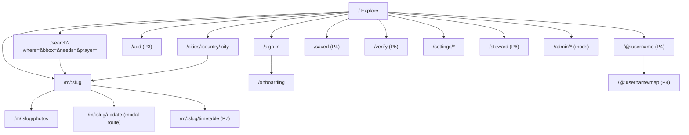
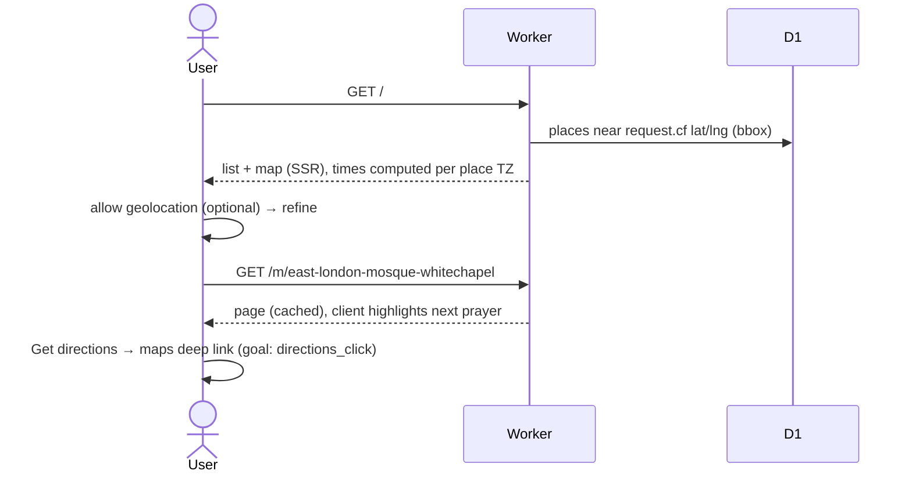

# 4. Sitemap, screens & flows

## 4.1 Sitemap

## 4.2 Route table

`P` = the phase that introduces the route. Routes are never removed (see [2.10](02-architecture.md#210-compatibility-rules-so-phases-never-break-each-other)).

| Route | P | Rendering | Auth | Purpose |
|---|---|---|---|---|
| `/` | 1 | RSC; client map | public | Explore: near-me (IP-geolocated via `request.cf`, refined by browser geolocation) list + map |
| `/search` | 1 | RSC + client | public | Same layout driven by URL params `where`, `bbox`, `needs[]`, `prayer`, `type`, `sort` |
| `/m/[slug]` | 1 | RSC, edge-cached | public | Mosque/prayer-space page |
| `/m/[slug]/photos` | 3 | RSC | public | Photo gallery by category |
| `/m/[slug]/update` | 2 | intercepted modal (`@modal/(.)m/[slug]/update`) + full page fallback | user | Update times/amenities |
| `/m/[slug]/history` | 2 | RSC | public | Per-fact change history (transparency) |
| `/m/[slug]/timetable` | 7 | RSC | public | Monthly timetable |
| `/m/[slug]/calendar.ics` | 7 | route handler | public | ICS feed |
| `/cities/[country]/[city]` | 1 | ISR-style cache (1h) | public | SEO landing: list + map + counts |
| `/countries/[country]` | 1 | cached | public | City index |
| `/add` | 3 | RSC + client | user | Add a mosque / prayer space |
| `/sign-in` | 2 | RSC | guest | Email OTP + Google |
| `/onboarding` | 2 | RSC | user without username | Choose username, name, optional home city |
| `/@[username]` | 4 | rewrite → `/u/[username]` | public (respects privacy) | Profile |
| `/@[username]/map` | 4 | rewrite → `/u/[username]/map` | public | Full-screen map, embeddable (`?embed=1`) |
| `/saved` | 4 | RSC | user | Saved places + their next iqamah |
| `/verify` | 5 | client | user | Quick verify at the nearest place |
| `/leaderboard` | — | RSC | public | Hasanat leaderboard (this week / month / all time), your tally and level, how to earn |
| `/settings/profile`, `/settings/privacy`, `/settings/notifications`, `/settings/account` | 2/4/6 | RSC | user | Settings (sections appear by phase) |
| `/steward`, `/steward/[slug]` | 6 | RSC | steward | Steward dashboard |
| `/admin`, `/admin/queue`, `/admin/reports`, `/admin/users`, `/admin/places/merge` | 2/3 | RSC | moderator | Moderation |
| `/about`, `/guidelines`, `/privacy`, `/terms`, `/attribution` | 1 | static | public | Content |
| `/api/auth/*` | 2 | better-auth | — | Auth endpoints |
| `/api/v1/places` | 1 | route handler | public | bbox GeoJSON for the map |
| `/api/v1/places/[id]/times` | 1 | route handler | public | Today's times JSON (used by PWA/widgets) |
| `/api/v1/geocode/autocomplete`, `/api/v1/geocode/details` | 1 | route handler | public (rate-limited, Turnstile after N) | "Where" search: areas (Photon), listed mosques and OpenStreetMap mosques (Photon), free |
| `/api/v1/places/[id]/source` | — | route handler | signed in (≤ 10 links a day) | link a mosque's Mawaqit page or Masjidal timetable |
| `/api/v1/uploads` | 3 | route handler | user | Signed upload + processing |
| `/og/m/[slug]`, `/og/u/[username]` | 1/4 | route handler (Satori → PNG via `workers-og`) | public | Share images |
| `/sitemap.xml`, `/robots.txt`, `/manifest.webmanifest` | 1/5 | generated | public | SEO/PWA |

**`/@username` note:** folders starting with `@` are parallel-route slots in the App Router, so
profile pages live at `app/(site)/u/[username]` and `proxy.ts` rewrites `/@:username(/.*)?`
to `/u/:username$1`. `/u/:username` itself 308-redirects to the `@` form (one canonical URL).
Usernames: `^[a-z0-9._]{3,30}$`, reserved list (`admin`, `api`, `m`, `u`, `settings`, …).

**Slugs:** `kebab(name)-kebab(locality)` plus `-2`, `-3` on collision (e.g.
`east-london-mosque-whitechapel`). Slug changes keep the old slug in `place_slug_history` → 308.

## 4.3 Screens

For each screen: purpose → key content → states. Visual reference in brackets.

### Explore / Search `/`, `/search` [Main.dc.html, P1; October 2026 redesign, spec 3.9]
- **Order on phones:** search pill + chips → "Prayer times · {area}" (calculated, labelled) → exact-location
  prompt → `HelpNudge` (add missing times, else confirm) → "N masajid nearby" + sort → rows → floating
  List/Map pill above the tab bar. Rows never show the calculated adhan: a masjid without jamā'ah times says
  so and offers "Add · +25". The points below describe the earlier layout where they conflict.
- **Header**: logo, `SearchPill` (Where · Prayer · Needs), "Add a mosque" (P3; before that "About"), account menu.
- **Search**: "Where" with a **Near me** button; a location permission the visitor already granted is used straight away, a denied one hides the "Use your location" prompt.
- **CategoryBar**: Has prayer times (mosque timetable or community-verified), Prayer rooms, then Filters (amenities live in the Filters dialog). The search box finds a masjid by name or an area.
- **List**: a legend for the three kinds of time, then rows whose chip says whose time leads the row: the mosque's timetable, community iqamah, or the calculated adhan. 40 rows, then "Show more". On wide screens the view is one screen tall: the list scrolls beside the map.
- **List**: overline "Next prayer · Asr adhan 4:35 PM", heading "38 mosques & prayer spaces nearby", a subline with the area and Hijri date, sort (Soonest iqamah / Distance / Most verified), a single column of `MosqueCard` rows, infinite scroll (24 per page). An area with no places yet shows **"Prayer times here today"** (calculated with the visitor's country default when the view is their own location, else Muslim World League; labelled) above the "Finding mosques…" state, so a first visit is never empty.
- **Map**: `PlaceMap` with pins for every loaded place (up to 200), a "Search this locality" button after the visitor moves the map, zoom, locate, legend, and a blue "you are here" dot (approximate from the server until the browser shares a precise position). On phones a List/Map switch shows one at a time.
- **States**: location permission prompt (inline card, not a browser popup on load), empty area CTA, offline banner, error toast.
- **Mobile**: list-first with a floating "Map" button; the map view has a bottom-sheet list (vaul snap points 20%/60%/100%).

### Mosque page `/m/[slug]` [Mosque.dc.html, MobileMosque.dc.html; October 2026 redesign]
- **Order:** breadcrumb (country › city) → name → summary → Get directions · Share · Save → **Jamā'ah times
  today** (mosque timetable; community table whose adhan column appears only for a community adhan
  adjustment, each iqamah tagged "fixed time" or "adhan + N min"; `TimesCheck`) → **Calculated prayer times
  here** (all six, labelled, never mixed into the jamā'ah table) → trust → Jumu'ah → Eid/Taraweeh → photos →
  facilities → about → **Questions people ask** (FAQ answered from the same data, also as `FAQPage`
  JSON-LD) → steward/edit links. JSON-LD: `Mosque` (address, geo, sameAs), `BreadcrumbList`, `FAQPage`.
- City pages split "With jamā'ah times" from "Waiting for their times", show the city's calculated times,
  and carry `ItemList` + `BreadcrumbList` + `FAQPage`. The home page carries `WebSite` (SearchAction) and
  `Organization`.
- Title, address, Share/Save (Save P4), summary line (type · Jumu'ah count · top amenities).
- **The mosque's own timetable** first when one is linked (Mawaqit/Masjidal): a solid-green table of its adhan and iqamah (jumu'ah on Fridays), credited "Published by the mosque on Mawaqit · updated …" with a link, and it drives the "Next prayer" card. The community table follows under "Community-reported times". Without one, a "Does this mosque publish its times on Mawaqit or Masjidal?" link opens a paste-the-link form.
- **Today's prayer times** (`PrayerTimesTable`), date + Hijri date, "Update timings" (P2), `DisputeBanner` (P2), calculation note + "Monthly timetable" (P7). With no iqamah yet, a compact "Iqamah times not yet added · Add iqamah times" row sits above the table and the waitlist email field below it.
- `TrustSummary` (P2), shown once iqamah times exist; "agreement" is a dash until at least two people have voted.
- Stewards row (P6; in P2–5 "Kept up to date by N contributors").
- **Jumu'ah** cards (P2).
- `PhotoGrid` after the times (P3 photos; else a credited Wikimedia Commons photo when `places.enrich` found one; else a slim "Add photos" prompt instead of a full-width illustration).
- **What this place offers** (`AmenityList`, P3; P1 shows OSM-derived facts marked "from OpenStreetMap").
- **About this place**: Wikipedia summary (linked, CC BY-SA), founding year, address, website, phone, sources line with the Wikidata ID (`places.enrich`; "From OpenStreetMap" without it).
- **Aside**: `NextPrayerCard` (one directions button: Apple Maps on Apple devices, Google Maps elsewhere; "I prayed here" P4), "Report a timing change" / "Report a problem" (P3), mini map with the pin and nearest transit (from OSM), `ActivityFeed` (P2).
- **Footer**: "Something missing? Suggest an edit", data attribution.
- SEO: `Place`/`PlaceOfWorship` JSON-LD (`Mosque` type), canonical URL, OG image.

### Update timings `/m/[slug]/update` [Contribute.dc.html, P2/P3]
Modal on desktop, drawer on mobile. Tabs: **Iqamah times** (P2), **Jumu'ah** (P2), **Amenities** (P3).
Iqamah tab: "Applies from" date picker (default tomorrow; "today" allowed), rows Fajr→Isha with
stepper, adhan shown for context, "was X" chip on changed rows, rule toggle per row ("fixed
time" vs "N min after adhan", used for Maghrib), "How do you know?" chips (Timetable board,
Mosque announcement, Asked the imam or committee, Website or socials), timetable photo (P3,
hidden before), footer Reset · "Goes live after N more confirmations" (computed) · primary
("Submit N changes" / "Confirm times are correct").

### Sign in `/sign-in` [P2]
Centered card: "Continue with Google", divider, email → 6-digit `InputOTP`, Turnstile
(invisible), and links to the terms and guidelines. Return-to URL preserved (e.g. back to the dispute banner action).

### Onboarding `/onboarding` [P2]
Username (live availability check, suggestions from name), display name, optional home city
(Places autocomplete, stored as a city label + country only), and a checkbox to agree to the
community guidelines. It then continues to the pending action.

### Add a place `/add` [P3]
Stepper in a single page:
1. **Find it**: Places autocomplete scoped to `types=mosque|place_of_worship` first, then anything. Duplicate check against our DB within 150 m ("Is it one of these?").
2. **Confirm details**: name (prefilled, editable), type (Mosque / Prayer room / Musalla / Eidgah), draggable pin on the map, address (editable), access notes (e.g. "inside Terminal 5, airside").
3. **Optional**: iqamah times, amenities, photo.
4. **Review & submit** → the place goes live immediately as *Unverified* (new accounts: *Pending* until a trusted user confirms or 24h passes with no report).

### Profile `/@[username]` [Profile.dc.html, MobileProfile.dc.html, P4]
Hero night map with pins, title "37 mosques. 16 countries.", filters (All time / year / Jumu'ah
only), stat tiles, "Share my map". Profile card (avatar, name, trust badge, stats), confirmed
info, a copy-link field. About (bio, most prayed in, Fajr count, Jumu'ah countries). Recently
prayed in (6), Badges, Contributions (filter chips + list). Privacy: when `checkins_public=false`,
the map section shows only countries, or is hidden entirely.

### Saved `/saved` [P4]
List of saved places with today's next iqamah and any "change reported" warnings.

### Quick verify `/verify` [MobileVerify.dc.html, P5]
Map background with "you are here", bottom sheet "YOU'RE AT East London Mosque" (nearest place
within 150 m, or a picker if several), then 1–3 questions chosen by value of information (open
disputes first, then oldest facts, then missing amenities, then timetable photo), and a success
screen with the updated counter and "See your map".

### Settings `/settings/*`
Profile (name, username change max once/30d with a redirect from the old one, bio, avatar P3),
Privacy (P4: profile public, check-ins public/countries only/private, show on leaderboards later),
Notifications (P6), Account (email, connected Google, export data, delete account).

### Admin `/admin/*` [P2+]
Queue (held contributions from new accounts, flagged photos), Reports, Users (trust level
override, suspend), Places (merge duplicates, close, restore), Audit log with revert.

### Leaderboard `/leaderboard`
Title "Serving the ummah", a cited hadith, your `HasanatCard` (or sign-in), period chips, ranked list
(public profiles with a username only), and "How to earn hasanat". Hasanat are read from `activity`
(`lib/hasanat.ts`): proposed 25, confirmed 10, reported change 10, place added 50, photo 15, Eid/Taraweeh
time 15, check-in 5.

## 4.4 Key flows

### F1 · Find the next jamā'ah (P1)

### F2 · Confirm or dispute a time (P2)
1. A signed-out user taps **Confirm 8:30** on the dispute banner → `/sign-in?next=…&intent=vote:<fact>:<value>`.
2. After sign-in and onboarding, the intent is replayed automatically, with a toast: "Thanks! Isha needs 1 more confirmation."
3. Server Action `castVote(factId, value, source)` → rate limit → trust check → insert vote → `recomputeFact(factId)` (synchronous, single fact) → revalidate `/m/[slug]` → `vote_cast` goal.

### F3 · Update timings (P2)
Open modal → adjust steppers → pick a source → submit → a Server Action creates a *candidate*
value (or a vote for an existing identical candidate) per changed fact, plus a **confirm** vote
for every unchanged fact ("Confirm times are correct") → a result sheet shows which values are
live vs. pending. Held if the user is trust level 0 and the place has a steward or ≥ 3 prior
confirmations of the old value.

### F4 · Add a missing place (P3)
Autocomplete → duplicate check → confirm details → submit → the place is created with facts
from the form as initial candidates (voted by the creator) → redirect to the new page with a
"You added this place" banner → `place_added` goal.

### F5 · "I prayed here" (P4)
Tap → a sheet asks which prayer (defaults to the current/most recent window) and whether to share
location for a verified check-in → the client sends coordinates once → the server computes the
distance and stores `geo_verified` if ≤ 150 m → the pin appears on the profile map → a toast offers
"Share your map" when a new country or city is reached.

### F6 · Quick verify at the mosque (P5)
Open the PWA → "I'm here" → nearest place resolved → 3 one-tap questions → votes stored with
`geo_verified=true` (weight × 1.5) → success.

### F7 · Resolve a dispute (P2, automatic)
Consensus engine promotes the candidate once `score ≥ threshold` and `lead ≥ margin` (see
[5.3](05-data-model.md#53-trust-engine)) → the old value is superseded with `effective_to` →
savers are notified (P6) → activity feed entry.

### F8 · Moderation (P2)
Reports and held items land in `/admin/queue` → a moderator approves/rejects/reverts → the
audit log records it → the user's trust score is adjusted.
