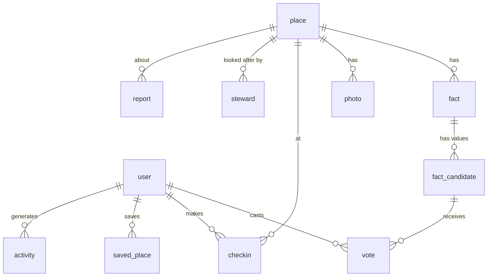

# 5. Data model & trust engine

D1 (SQLite) via Drizzle. IDs are ULIDs (`text`, sortable). Timestamps are `integer` unix ms (UTC).
Local prayer times are `text` `HH:MM` in the **place's timezone**. Each table lists the phase
that creates it; columns added later are marked `(Pn)`. All migrations are additive
([2.10](02-architecture.md#210-compatibility-rules-so-phases-never-break-each-other)).

## 5.1 Entity overview



## 5.2 Tables

### Phase 1 — directory

**`place`**
| Column | Type | Notes |
|---|---|---|
| `id` | text PK | ULID |
| `slug` | text unique | see 4.2 |
| `name` | text | community-confirmed display name |
| `name_local` | text null | native-script name (OSM `name`, when `name:en` is used for `name`) |
| `kind` | text | `mosque` \| `prayer_room` \| `musalla` \| `eidgah` |
| `status` | text | `active` \| `pending` (P3) \| `closed` \| `merged` \| `hidden` |
| `merged_into_id` | text null | P3 |
| `lat`, `lng` | real | |
| `geohash6` | text | indexed; neighbour-prefix queries |
| `address`, `locality`, `region` | text | |
| `country_code` | text(2) | indexed |
| `city_slug` | text | for `/cities/:country/:city` |
| `timezone` | text | IANA, from `tz-lookup` |
| `calc_method` | text | adhan-js method key; default by country table |
| `asr_madhab` | text | `shafi` \| `hanafi`; default by country, a fact from P2 |
| `osm_type`, `osm_id` | text, integer null | unique together |
| `google_place_id` | text null | P3 |
| `google_latlng_fetched_at` | integer null | P3 (30-day refresh rule) |
| `created_by` | text null → user | P3 |
| `verification_state` | text | derived: `none` \| `partial` \| `verified` \| `needs_check` (P2) |
| `last_verified_at` | integer null | derived (P2) |
| `iqamah_summary_json` | text null | denormalised current iqamahs for cards/pins (P2) |
| `amenity_bits` | integer | denormalised bitset for filters (P3) |
| `created_at`, `updated_at` | integer | |

Indexes: `(country_code, city_slug)`, `(geohash6)`, `(lat, lng)`, `(status)`.

**`place_fts`**: FTS5 virtual table (`name`, `name_local`, `locality`, `region`), content=`place`, kept in sync by triggers.

**`place_slug_history`** (`old_slug` PK, `place_id`, `created_at`).

**`city`** (`country_code`, `city_slug` PK pair, `name`, `lat`, `lng`, `place_count`, `bbox_json`): rebuilt nightly by cron.

**`calc_default`** (`country_code` PK, `calc_method`, `asr_madhab`, `high_lat_rule`): seed table built from a reviewed per-country list (e.g. `SA → UmmAlQura`, `PK → Karachi`, `US → NorthAmerica`, fallback `MuslimWorldLeague`). It is only a default: `asr_madhab` becomes a community fact in P2 and `calc_method` is editable by moderators.

### Phase 2 — accounts & trusted times

**better-auth core** (generated by `@better-auth/cli generate` for Drizzle): `user`, `session`,
`account`, `verification`. **Extra `user` columns:**

| Column | Type | Notes |
|---|---|---|
| `username` / `display_username` | text unique | username plugin |
| `bio` | text null | ≤ 280 chars (P4 displays) |
| `home_city_label`, `home_country` | text null | |
| `role` | text | `user` \| `moderator` \| `admin` (admin plugin) |
| `trust_level` | integer | 0–3, derived nightly and on events |
| `reputation` | integer | accepted contributions − penalties |
| `accepted_count`, `rejected_count` | integer | |
| `banned`, `ban_reason`, `ban_expires` | admin plugin | |
| `profile_public` | integer bool | default 1 (P4 UI) |
| `checkins_visibility` | text | `public` \| `countries` \| `private`; default `public` (P4) |
| `avatar_key` | text null | R2 key (P3) |
| `deleted_at` | integer null | soft delete → anonymised |

**`fact`**: one row per (place, key, qualifier)
| Column | Type | Notes |
|---|---|---|
| `id` | text PK | |
| `place_id` | text → place | |
| `key` | text | registry below |
| `qualifier` | text | `''` or e.g. jamā'ah index `'1'`, `'2'` |
| `current_candidate_id` | text null | accepted value |
| `state` | text | `unknown` \| `unverified` \| `verified` \| `disputed` \| `stale` |
| `confidence` | real | 0–1 |
| `last_confirmed_at` | integer null | |
| `updated_at` | integer | |
Unique `(place_id, key, qualifier)`.

**`fact_candidate`**: a proposed value
| Column | Type | Notes |
|---|---|---|
| `id` | text PK | |
| `fact_id` | text → fact | |
| `value_json` | text | canonical JSON (e.g. `{"t":"20:30"}`, `{"rule":"after_adhan","min":5}`, `{"v":true,"note":"First floor"}`) |
| `value_hash` | text | sha-256 of canonical JSON; unique `(fact_id, value_hash, effective_from)` |
| `effective_from` | text (date) | local date |
| `effective_to` | text null | set when superseded |
| `status` | text | `candidate` \| `current` \| `superseded` \| `rejected` \| `held` |
| `score` | real | cached weighted score |
| `created_by` | text → user | |
| `created_at` | integer | |

**`vote`**
| Column | Type | Notes |
|---|---|---|
| `id` | text PK | |
| `candidate_id` | text → fact_candidate | |
| `user_id` | text → user | |
| `polarity` | integer | `+1` confirm, `−1` dispute |
| `source` | text | `board` \| `announcement` \| `imam` \| `website` \| `observed` \| `other` |
| `weight` | real | computed at cast time (snapshot) |
| `geo_verified` | integer bool | P5 |
| `evidence_photo_id` | text null | P3 |
| `created_at` | integer | |
Unique `(candidate_id, user_id)`: re-voting updates the row. A user voting +1 on a candidate
automatically withdraws their +1 on sibling candidates of the same fact.

**`activity`**: append-only public event log (`id`, `actor_id`, `place_id`, `type`,
`payload_json`, `created_at`, `visibility`). It powers the mosque activity feed and profile contributions.

**`audit_log`**: moderator/system actions with before/after JSON; revert references.

**`report`** (`id`, `target_type` place|candidate|photo|user, `target_id`, `reason`, `note`,
`reporter_id` null, `status` open|resolved|dismissed, `resolved_by`, timestamps). *(Created in P2 for
timing reports; photos/places use it in P3.)*

**`held_item`**: view over `fact_candidate.status='held'` plus photos pending (P3) for the admin queue.

### Phase 3 — amenities, places & photos

**`photo`** (`id`, `place_id`, `r2_key`, `variant_keys_json`, `category`
exterior|prayer_hall|women|wudhu|entrance|timetable|other, `width`, `height`, `blurhash`,
`status` pending|approved|rejected, `ai_labels_json`, `uploaded_by`, `created_at`).

**`place_duplicate_candidate`** (`a_id`, `b_id`, `distance_m`, `name_similarity`, `status`).

New `fact.key`s registered (amenities). No schema change to facts/votes is needed.

### Phase 4 — profiles & check-ins

**`checkin`** (`id`, `user_id`, `place_id`, `prayer` fajr|dhuhr|asr|maghrib|isha|jumuah|eid|taraweeh|other,
`local_date`, `geo_verified`, `distance_m` null, `note` null, `created_at`). Unique `(user_id,
place_id, local_date, prayer)`. Index `(user_id, created_at)`.

**`user_place_stat`** (`user_id`, `place_id`, `first_at`, `last_at`, `count`) and
**`user_stat`** (`user_id` PK, `places`, `countries`, `cities`, `continents`, `jumuah_countries`,
`fajr_places`, `verifications`, `places_added`, `photos`, `updated_at`): maintained via Queue.

**`badge`** (`key` PK, `name`, `description`, `icon`, `rule_json`) and **`user_badge`**
(`user_id`, `badge_key`, `awarded_at`).

**`saved_place`** (`user_id`, `place_id`, `created_at`).

### Phase 5
**`push_subscription`** (`id`, `user_id`, `endpoint`, `p256dh`, `auth`, `created_at`). Web push is used in P6.

### Phase 6
**`steward`** (`place_id`, `user_id`, `role` steward|lead, `status` requested|approved|revoked,
`evidence`, `approved_by`, timestamps). **`notification_pref`** (`user_id`, `channel`
email|push, `topic` saved_changes|digest|steward_alerts, `enabled`). **`notification`** (in-app inbox).

### Phase 7
**`timetable`** (`id`, `place_id`, `month` YYYY-MM, `source_photo_id`, `status`, `created_by`) and
**`timetable_row`** (`timetable_id`, `local_date`, `prayer`, `adhan` null, `iqamah`), with
**`special_prayer`** (`place_id`, `kind` eid_fitr|eid_adha|taraweeh|tahajjud|janazah, `date`,
`times_json`, `notes`). Timetable rows are imported as dated `fact_candidate`s (so one trust
engine governs everything) and the table is kept as the provenance record.

### Launch
**`osm_cell`** (`geohash` PK, `status` filling/done/failed, `started_at`, `synced_at`, `inserted`, `error`):
one row per geohash-4 cell filled on demand from Overpass; the `filling` status doubles as a two-minute lock.
**`place.adhan_adjust_json`**: the community's per-prayer adhan adjustments (see `adhan.*` below).

### Enrichment
**`place.wikidata_id`** and **`place.enrichment_json`** (`{wikidata, image:{file,thumb,page,author,license,licenseUrl}, wikipedia:{title,url,extract}, inception, nameAr}`):
what the free open-data match found (`lib/enrich/wikidata.ts`). **`enrich_cell`** (`geohash` PK, `status` done/failed,
`synced_at`, `matched`, `error`): one row per geohash-4 cell matched against Wikidata, refreshed quarterly.

### Phase 8
**`api_key`** (`id`, `owner_id`, `hash`, `scopes`, `rate_limit`, `created_at`, `revoked_at`) and
**`export_run`** (`id`, `kind`, `r2_key`, `rows`, `created_at`).

## 5.3 Fact key registry

| Key | Qualifier | Value | Phase |
|---|---|---|---|
| `iqamah.fajr` … `iqamah.isha` | — | `{t:"HH:MM"}` or `{rule:"after_adhan",min:N}` | 2 |
| `jumuah.jamaah` | `1..6` | `{t:"13:15", khutbah:"12:55", lang:["en"]}` | 2 |
| `asr_madhab` | — | `{v:"hanafi"}` (copied to `place.asr_madhab` when current) | 2 |
| `adhan.method` | — | `{v:"NorthAmerica"}`: an adhan-js method the mosque's timetable follows (copied to `place.calc_method`) | launch |
| `adhan.fajr` … `adhan.isha` | — | `{min:-120..120}` minutes from the calculated adhan, or `{t:"HH:MM"}` fixed; denormalised to `place.adhan_adjust_json` and applied by `getPrayerDay` everywhere | launch |
| `amenity.women_section` | — | `{v:true\|false, note?}` | 3 |
| `amenity.wudhu_men`, `amenity.wudhu_women` | — | same | 3 |
| `amenity.step_free`, `amenity.parking`, `amenity.toilets`, `amenity.classes`, `amenity.janazah`, `amenity.open_between_prayers`, `amenity.open_for_fajr` | — | same | 3 |
| `info.phone`, `info.website`, `info.languages` | — | strings | 3 |
| `status.closed` | — | `{v:true, reason}` | 3 |
| `special.*` | date | see P7 | 7 |

## 5.4 Trust engine

Pure TypeScript in `/lib/trust`, fully unit-tested; invoked synchronously after each vote for the
affected fact and nightly for decay.

### Vote weight
```
base = {L0: 1, L1: 1.5, L2: 2.5, L3: 3}[trust_level]
     + (steward of this place ? 2 : 0)          // P6
w    = base × (geo_verified ? 1.5 : 1)          // P5
          × (evidence photo approved ? 1.5 : 1) // P3
          × (source == 'board' or 'announcement' ? 1.2 : 1)
```

### Candidate score (with recency decay)
`score(c) = Σ polarity·w·decay(age)` where `decay = 0.5^(age_days / 45)`.

### Promotion rules
For fact `f` with current value `cur` and best challenger `c`:
- **No current value**: `c` becomes current as soon as `score(c) ≥ 1` → state `unverified`.
- **Replace current**: `c` becomes current when `score(c) ≥ 3` **and** `score(c) − score(cur) ≥ 2`
  (and ≥ 2 distinct users). `cur` → `superseded` with `effective_to = c.effective_from − 1 day`.
- A dated candidate (`effective_from` in the future) is promoted but only *displayed* from its date.

### Fact state
| State | Rule |
|---|---|
| `verified` | current value `score ≥ 3` from ≥ 2 users and `last_confirmed_at` ≤ 60 days |
| `unverified` | has a current value that doesn't meet the verified rule |
| `disputed` | a challenger has `score ≥ 1` from someone other than its author |
| `stale` | last confirmation > 60 days (shown as amber "Needs check") |
| `unknown` | no value |

Place `verification_state` = `verified` if all five daily iqamahs are verified; `partial` if any
are; `needs_check` if any is disputed/stale; else `none`. "Agreement %" on the page =
Σ(+w)/Σ(|w|) over the last 90 days for the place's current values.

### Trust levels
| Level | Name | Requirement | Limits |
|---|---|---|---|
| 0 | New | verified email | 20 votes/day, 5 new values/day; changes to *verified* facts are **held** until one L1+ confirms or 48h pass with no dispute |
| 1 | Contributor | ≥ 5 accepted contributions, ≥ 7 days | 100 votes/day |
| 2 | Trusted verifier | ≥ 50 accepted, ≥ 90% acceptance, ≥ 30 days | 300/day; can approve held items |
| 3 | Moderator-trusted | granted by moderator | unlimited; merges |

"Accepted contribution" = a vote or value that ends up on the current value, or a photo that is
approved. Contributions that are later reverted by a moderator count −5.

### Abuse controls
- Distinct-user requirement (above); votes from accounts < 24h old don't count toward
  promotion of replacements.
- Burst detection: > N votes on one place from new accounts within 1h → hold + flag.
- Moderator revert restores the previous current value and recomputes affected facts and users.
