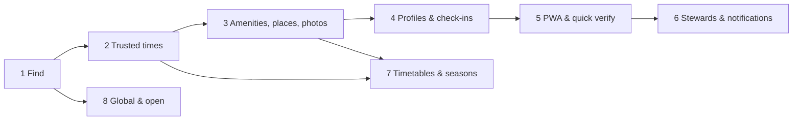

# 6. Delivery phases

Phases are ordered by priority. **Each phase is a complete, production-deployed product on its
own**: if we stopped after any phase, what is live is coherent, useful and supportable.

## 6.0 Definition of done (applies to every phase)

A phase is done only when all of these hold in **production**:

- [ ] All scope items are live on `main` (no feature flags since October 2026).
- [ ] The phase's Playwright suite (`e2e/phase-N`) passes against production (`@smoke`) and preview (full); **all earlier phase suites still pass**.
- [ ] Unit + integration coverage ≥ 80% on new `lib/` code; the trust engine and prayer logic ≥ 95%.
- [ ] axe: 0 serious/critical violations on new screens; keyboard-only pass done.
- [ ] Lighthouse mobile on new key pages: Performance ≥ 90, Accessibility ≥ 95, SEO ≥ 95.
- [ ] Migrations are additive and applied, and a Time Travel bookmark was recorded.
- [ ] Sentry alerts are wired for new routes; dashboards (Workers Observability) are updated.
- [ ] DataFast goals for the phase fire (verified in the DataFast dashboard).
- [ ] Rate limits and authZ tests exist for every new mutation.
- [ ] `/privacy`, `/terms`, `/guidelines` are updated if data collection changed.
- [ ] A runbook entry exists in `docs/runbooks/phase-N.md` (rollback = previous Worker version; migrations are forward-compatible, so no DB rollback is needed).

---

## Phase 1 — Find a mosque

**Goal:** anyone can find the nearest mosque or prayer space anywhere in the world and see
today's calculated adhan times, fast, on any device. No accounts yet.

**Why first:** it is the core utility and the SEO surface everything else builds on, and it has
no cold-start problem because it is seeded from OpenStreetMap.

### Scope
1. **Project foundation**: vinext app on Workers, Tailwind v4 + shadcn/ui themed per the
   [design system](03-design-system.md), fonts, dark mode, `SiteHeader`, footer, error/404
   pages, CSP, Sentry, DataFast script, KV flags, CI/CD pipeline, preview environments.
2. **Directory seed**: `scripts/import-osm.ts` pulls Overpass extracts per region (nodes, ways
   and relations; ways/relations reduced to centroids), normalises names, derives `kind`,
   `locality/region/country` (from OSM `addr:*`, else reverse lookup against a bundled admin-boundary
   dataset), `timezone` via `tz-lookup`, slugs, and `city` rows, then writes batched SQL for
   `wrangler d1 execute`. Idempotent upserts keyed on `(osm_type, osm_id)`. A weekly cron diff-sync
   is added in Phase 3.
3. **Prayer time service** (`lib/prayer`): adhan-js per place with `calc_default`, high-latitude
   rule, DST-safe; returns today's and tomorrow's adhan times plus the next-prayer pointer. Hijri date
   via `Intl`. Unit fixtures: London (DST switch days), Oslo in June (high latitude), Makkah,
   Jakarta, Toronto, Hanafi vs Shafi Asr.
4. **Explore / Search** (`/`, `/search`): IP-based initial location (`request.cf.latitude/longitude`),
   an opt-in browser geolocation card, "Where" autocomplete through our `/api/v1/geocode/*` proxy
   to Google Places Autocomplete (regions/cities; session tokens; Turnstile after 20 requests per
   session), map + list with `TimePin`s showing the **next adhan** (the label reads "Asr 4:12 · adhan";
   switches to iqamah in P2), clustering, "Search this area" on map move, sort by distance,
   filters available from OSM data (prayer rooms vs mosques). URL-synced state.
5. **Mosque page** `/m/[slug]`: header, placeholder `PhotoGrid` (tinted illustration), today's
   table with **Adhan** column and an **Iqamah** column reading "Not yet added", the calculation
   note, OSM-derived info (address, website/phone if tagged, wheelchair tag → "from OpenStreetMap"),
   `NextPrayerCard` with countdown and **Get directions** (Google Maps / Apple Maps deep link),
   a mini map, JSON-LD, OG image `/og/m/[slug]`.
6. **City & country pages** for SEO; `sitemap.xml` (chunked ≤ 50k URLs per file), `robots.txt`,
   canonical URLs.
7. **Content pages**: About, Guidelines (draft for P2), Privacy, Terms, Attribution (OSM, OpenFreeMap,
   Google, Natural Earth, adhan-js, ODbL commitment).
8. **"Get notified" email capture** on mosque pages with no iqamah data: stored in
   `waitlist(email, place_id, created_at)` with double opt-in via Email Service (confirm link). It
   sets up email infra and deliverability early and seeds P2 announcements.

### Data
Tables: `place`, `place_fts`, `place_slug_history`, `city`, `calc_default`, `waitlist`.

### Integrations
Google Places (Autocomplete + Details for geocoding only; nothing stored), OpenFreeMap, Email
Service (waitlist confirmation), Turnstile (geocode abuse), DataFast, Sentry.

### Analytics goals
`search` (props: `has_where`, `filters`), `map_moved`, `mosque_view` (`country`), `directions_click`,
`geolocation_granted`, `waitlist_joined`, `share_click`.

### Acceptance (E2E `e2e/phase-1`)
1. Visiting `/` from a London IP (mocked `cf` in preview) shows ≥ 10 places, the map renders pins, and the list and map stay in sync on hover.
2. Typing "Istanbul" in Where and selecting it moves the map; the URL updates; a reload restores the same view.
3. Opening a mosque page shows 6 rows (Fajr, Sunrise, Dhuhr, Asr, Maghrib, Isha) whose adhan times equal adhan-js output for that place/date/method (fixture), highlights the next prayer, and shows the countdown.
4. On a Friday, the Dhuhr row is labelled Jumu'ah.
5. Get directions opens a maps URL containing the place's coordinates.
6. `/cities/gb/london` lists places and has valid JSON-LD; `sitemap.xml` includes it.
7. Waitlist: submitting an email sends a confirmation (captured by the preview email sink); clicking the link confirms it.
8. The mosque page LCP is < 2.5 s on throttled mobile (Lighthouse CI).

### Out of scope
Accounts, iqamah data, amenities beyond OSM tags, photos.

---

## Phase 2 — Trusted iqamah times

**Goal:** the community can add, confirm and correct **iqamah** and **Jumu'ah** times, and every
visitor can see how trustworthy each time is. This is the core differentiator.

### Scope
1. **Auth** (better-auth): email OTP (6-digit, `InputOTP`), Google OAuth, sessions, username
   plugin, admin plugin (roles, ban). `/sign-in`, `/onboarding`, `/settings/profile`,
   `/settings/account` (export JSON, delete account). Intent replay after sign-in. Turnstile on
   sign-in. Emails: OTP code, welcome, account deletion confirmation (React Email, via `q-email`).
2. **Facts + votes engine** (`lib/trust`) and tables `fact`, `fact_candidate`, `vote`, `activity`,
   `audit_log`, `report`; trust levels and limits; synchronous recompute per vote; a nightly cron for
   decay/state/trust levels; `iqamah_summary_json` and `verification_state` denormalised onto `place`.
3. **Update timings** modal/drawer (`/m/[slug]/update`): Iqamah and Jumu'ah tabs, `TimeStepper`,
   fixed vs "after adhan" rule, effective-from date, source chips, "Confirm times are correct".
4. **Mosque page upgrades**: Iqamah column with per-row status ("Verified 2 days ago · 9
   people", "Unverified", "Needs check"), `TrustSummary`, `DisputeBanner` with one-tap votes,
   Jumu'ah cards, `ActivityFeed`, `/m/[slug]/history` (transparent per-fact history),
   "Report a timing problem" (creates a `report`).
5. **Explore upgrades**: pins and cards show the **next iqamah** when known (falling back to adhan with
   an "adhan" label), card chips "Community verified" / "Change reported", sort "Soonest iqamah",
   filter "Has verified times".
6. **Moderation**: `/admin/queue` (held candidates), `/admin/reports`, `/admin/users` (trust
   override, ban), audit log + revert. Moderators are created by an admin CLI script.
7. **Guidelines** page finalised; the P1 waitlist members get a "times are live" email (one-off
   broadcast script with unsubscribe).

### Analytics goals
`signup_started`, `signup_completed` (`method`), `onboarding_completed`, `update_opened`,
`contribution_submitted` (`changed_count`), `vote_cast` (`polarity`, `fact_key`), `report_created`,
`dispute_resolved` (server).

### Acceptance (E2E `e2e/phase-2`)
1. Sign up with email OTP (preview sink), choose a username, land back on the original page.
2. On a place with no iqamah, set Asr 4:30 → the page immediately shows 4:30 "Unverified"; a card on `/` shows "Asr 4:30".
3. A second user confirms → the state stays Unverified (needs score ≥ 3); a third L1 user confirms → "Verified · 3 people" (weights set via fixture trust levels).
4. A user proposes Isha 8:30 against a verified 8:45 → the dispute banner appears for others; two trusted confirms promote 8:30; the history page shows 8:45 superseded.
5. A level-0 account's change to a verified fact is **held** and appears in `/admin/queue`; a moderator approves → it goes live; a revert restores the old value.
6. Rate limit: the 21st vote in a day by an L0 user returns a friendly error.
7. Account deletion anonymises activity ("former member") and keeps the facts intact.
8. **Phase 1 suite passes unchanged** (the adhan table and search work signed out).

---

## Phase 3 — Amenities, places & photos

**Goal:** people can filter by what they need (women's section, wudhu, step-free…), add missing
mosques and prayer spaces, and see real photos.

### Scope
1. **Amenity facts** (registry 5.3) using the same engine. An Amenities tab in the update dialog with
   Yes/No/Not sure; `AmenityList` on the page; `amenity_bits` denormalised; CategoryBar and
   `FiltersDialog` filters wired (Women's section, Wudhu, Step-free, Parking, Open for Fajr,
   Classes). OSM tags imported as initial `unverified` candidates authored by a system user.
2. **Add a place** (`/add`): Google Places Autocomplete + Place Details (field mask: `id,
   displayName, formattedAddress, location, addressComponents, types`), duplicate detection
   (≤ 150 m + trigram name similarity), draggable pin, kind, access notes, optional initial
   times/amenities/photo. New L0 places are `pending` (visible with a "New" badge to the creator
   and L2+, public after 24h with no report or 1 L1+ confirm). Google `place_id` stored; a cron
   refreshes lat/lng every 30 days per Google terms. Live Google fields (phone, website, opening
   hours) shown on the page with attribution, cached in KV ≤ 24h.
3. **Photos**: `/api/v1/uploads` (auth, Turnstile for L0) → R2 `originals/` → `q-media` consumer:
   Images binding resize to 1600/800/400 WebP, strip metadata, blurhash, then Workers AI image
   classification to flag unsafe or off-topic images → `pending` for L0 (queue) / auto-approve for
   L1+ unless flagged; originals deleted. `PhotoGrid`, `/m/[slug]/photos` gallery by category,
   timetable photos attachable as vote evidence (weight ×1.5 when approved). Avatars uploaded the same way.
4. **Place quality**: report types (closed, duplicate, wrong location, inappropriate photo);
   `/admin/places/merge` merges places (facts, votes, photos, check-ins re-pointed; slug
   redirect); `status.closed` fact; weekly OSM diff-sync cron (new places only; never overwrites
   community-edited fields).
5. **Header** gains "Add a mosque"; the empty map state gets "Add a place here".

### Analytics goals
`filter_applied` (`amenity`), `place_add_started`, `place_added` (`kind`, `country`),
`duplicate_detected`, `photo_uploaded` (`category`), `amenity_vote_cast`.

### Acceptance (E2E `e2e/phase-3`)
1. Filtering by Women's section on `/` shows only places whose `amenity.women_section` is current `true`, and the URL encodes the filter.
2. Adding a place via a mocked Places response → the duplicate prompt appears for a nearby existing place → choosing "It's new" creates `/m/<slug>` with the entered times.
3. Uploading a JPEG with GPS EXIF → the served WebP has no EXIF; an L0 upload is pending until approved in admin.
4. Merging two duplicates redirects the old slug (308) and carries their votes.
5. Pages for places without photos still render the illustration (no broken images).
6. Phase 1–2 suites pass.

---

## Phase 4 — Profiles & "I prayed here"

**Goal:** the shareable identity layer: every user has `mosques.world/@username` showing their
contributions and a beautiful map of every mosque they have prayed in. It is the viral loop and
the reward for contributing.

### Scope
1. **Check-ins**: "I prayed here" on the mosque page and cards → sheet (prayer, date defaults to now,
   optional "use my location to verify"); `checkin` table; one per (place, date, prayer);
   backfill allowed ("I prayed here before" with month/year, unverified).
2. **Profile** `/@[username]` (rewrite from `/u/[username]`): `ProfileHeroMap` (MapLibre,
   Natural Earth night style, gold pins sized by visit count, globe at low zoom, filters: all
   time / year / Jumu'ah only), stats tiles, `ProfileCard`, About, Recently prayed in, Badges,
   Contributions (from `activity`, filter chips with counts), `/@[username]/map` full-screen +
   `?embed=1` iframe mode.
3. **Stats & badges**: `user_stat`, `user_place_stat` maintained by `q-recompute`; badge rules
   (Trusted verifier, Fajr regular, Jumu'ah traveller, Founding contributor (first 1,000 users),
   Globetrotter 5/10/25 countries, Timetable keeper). Toasts when a badge or a new country is earned.
4. **Sharing**: `/og/u/[username]` 1200×630 card (night map SVG + "37 mosques · 16 countries"),
   Web Share API, copy link, share prompts at milestones.
5. **Saved places** (`/saved`, Save buttons now active) with today's iqamah and warnings.
6. **Privacy settings**: profile public/private; check-ins public / countries-only / private;
   individual check-in delete. Private profiles return a minimal page (name + contributions only).

### Analytics goals
`checkin_created` (`geo_verified`, `prayer`), `profile_view` (`own`), `profile_shared`
(`channel`), `map_embed_view`, `badge_earned` (`badge`), `place_saved`.

### Acceptance (E2E `e2e/phase-4`)
1. A new user checks in at 3 places in 2 countries → `/@user` shows 3 pins, "3 mosques. 2 countries.", and the Recently prayed in list.
2. A geo-verified check-in with mocked geolocation 60 m away stores `geo_verified=1` and **no coordinates** (DB assertion).
3. Setting check-ins to "countries only" hides the pins and place names from a signed-out viewer while the counts remain.
4. `/og/u/user` returns a 1200×630 PNG under 300 KB.
5. `/u/user` 308-redirects to `/@user`; an unknown username returns 404.
6. Phase 1–3 suites pass.

**This completes the MVP shown in the design.**

---

## Phase 5 — At the mosque (PWA + quick verify)

**Goal:** make contributing effortless on a phone at the mosque, which is where accurate data comes from.

### Scope
1. **PWA**: `manifest.webmanifest`, icons, maskable icon, service worker (Workbox via
   `vite-plugin-pwa`): app-shell caching, offline saved mosques (their times for the next 7
   days precomputed and cached), install prompt after the 2nd visit.
2. **"I'm here"** entry points: mobile action bar, `/verify`. Resolve the nearest place ≤ 150 m
   (picker if several); combined check-in + quick verify.
3. **Quick verify** (`QuickVerifySheet`): up to 3 questions chosen by expected information gain
   (open disputes > stale > unverified > missing amenities > timetable photo); each is one tap;
   votes carry `geo_verified=true` (weight ×1.5); success screen with running total.
4. **Mobile polish**: bottom-sheet map list, sticky action bar, haptics where supported,
   `push_subscription` capture (permission asked only after a successful verify, used in P6).

### Analytics goals
`pwa_installed`, `im_here_tapped`, `quick_verify_completed` (`answers`), `offline_open`.

### Acceptance (E2E `e2e/phase-5`, WebKit mobile)
1. With mocked location at a place, `/verify` shows "YOU'RE AT <name>" and a disputed Isha question first; answering 3 questions records 3 geo-verified votes.
2. Offline mode (Playwright `context.setOffline`) still shows saved places' times.
3. Lighthouse PWA installability checks pass.
4. Phase 1–4 suites pass.

---

## Phase 6 — Stewards & notifications

**Goal:** close the loop with the people who know the times best, and tell people when times change.

### Scope
1. **Stewards**: "Are you involved with this mosque?" → request with evidence (role, contact,
   optional photo) → moderator approval → steward badge on the page ("Looked after by N stewards"),
   +2 vote weight, and a steward dashboard (`/steward`) listing their places' open disputes, stale facts
   and held items, with one-click confirm.
2. **Notifications**: `notification_pref`; in-app inbox; email via `q-email`; web push (VAPID,
   `@block65/webcrypto-web-push` or an equivalent Workers-compatible library).
   Topics: saved place's time changed (sent at promotion time), weekly digest for contributors (cron:
   your impact, places needing checks near you), steward alerts (new dispute on your place).
   One-click unsubscribe (RFC 8058 `List-Unsubscribe-Post`) on every email.
3. `/settings/notifications`.

### Analytics goals
`steward_requested`, `steward_approved`, `notification_sent` (server, `channel`, `topic`),
`notification_opened`, `unsubscribe`.

### Acceptance (E2E `e2e/phase-6`)
1. User A saves a place; user B's change gets promoted → A receives an email (preview sink) and an in-app notification with the old → new time.
2. A steward's single confirm verifies a fact that needed 2 L0 confirms before.
3. The unsubscribe link disables that topic without sign-in.
4. Phase 1–5 suites pass.

---

## Phase 7 — Timetables & seasons

**Goal:** show the whole month and the seasonal prayers people search for most (Ramadan, Taraweeh, Eid).

### Scope
1. **Monthly timetable** `/m/[slug]/timetable?month=`: grid of dated iqamahs; entries come from
   dated `fact_candidate`s, so the same trust engine applies.
2. **Photo → timetable**: upload a timetable photo → Workers AI vision model extracts a table →
   an editable review grid → submitting creates dated candidates with the photo as evidence
   (stewards' imports auto-promote).
3. **Special prayers**: Eid al-Fitr / al-Adha (multiple jamā'ahs, location e.g. the park), Taraweeh
   (rakʿahs, start time), Tahajjud in the last 10 nights; a seasonal explore mode ("Eid prayers near you").
4. **Calendar feeds**: `/m/[slug]/calendar.ics` (iqamah events, 30 days rolling) and a per-user
   feed of saved places.

### Analytics goals
`timetable_view`, `timetable_imported` (`rows`), `ics_subscribed`, `eid_search`.

### Acceptance
1. Importing a fixture timetable photo (mocked AI output) creates 30 × 5 dated values, and the page shows the correct iqamah for a date in that month.
2. The ICS feed validates (icalendar parser) and uses the place's timezone.
3. Phase 1–6 suites pass.

---

## Phase 8 — Global & open

**Goal:** the product works in the world's major Muslim languages, and the data is given back as open data.

### Scope
1. **i18n**: locale-prefixed routes `/{locale}/…` added **alongside** the existing unprefixed
   routes (unprefixed = negotiated default, so no URL breaks), `next-intl`-style message catalogs;
   locales en, ar (RTL), ur (RTL), bn, id, ms, tr, fr; Amiri/Noto Naskh fonts; `hreflang`;
   localized prayer names; 12/24h per locale.
2. **Public read API** `/api/v1/…` with API keys (free tier, rate-limited), OpenAPI docs page.
3. **Open data**: monthly ODbL export (GeoJSON + CSV of places with current facts and
   provenance counts; no user data) to R2 with a public download page.

### Acceptance
1. `/ar/m/[slug]` renders RTL with Arabic prayer names; `/m/[slug]` is unchanged.
2. The API returns the same times as the page for a sample of places; keys are rate-limited.
3. The export file validates as GeoJSON and contains no PII columns.
4. Phase 1–7 suites pass.

---

## October 2026 redesign (no phase)

Mobile-first Airbnb-style redesign (spec 3.9): tab bar, explore with calculated area times and one ask,
mosque page that never shows calculated times as a masjid's own, one-tap "Yes, still right", hasanat
tally, levels and `/leaderboard`, WhatsApp share loops, FAQ/breadcrumb/WebSite structured data.
No migration: hasanat are computed from `activity`.

**Analytics goals:** `nudge_clicked` (`kind`: `add_times` | `confirm`); `share_click` gains `surface`
values `explore_nudge`, `times_confirmed`, `times_confirmed_link`, `ask_for_times`,
`after_update_whatsapp`; `update_opened` gains `from`; `vote_cast` with `fact_key: confirm_all` for the
one-tap confirm.

---

## Phase dependency map

P7 and P8 can run in parallel with P5–P6 if the team has capacity.

## Open questions

1. **Calculation defaults per country**: validate the `calc_default` list with local scholars/communities before launch.
2. **Launch cities** for community seeding (steward outreach): suggestion London, Istanbul, Kuala Lumpur, Toronto, Mumbai.
3. **Google Places budget**: set the monthly cap (and alert threshold) before P3.
4. **Moderation staffing**: who holds the initial moderator roles in P2?
5. **Brand**: final logo mark and whether the pin gold becomes a user-selectable accent on profiles.
